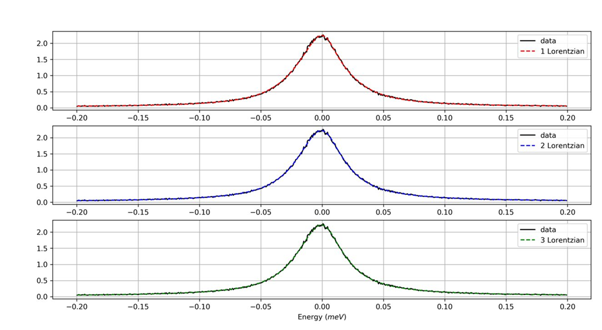

Welcome To quickBayes
=====================

The quickBayes package is an open source library for calculating a fast approximation of the Bayesian evidence for use in model selection.
The package is cross platform, supporting Windows, Mac OS and Linux.
This package has been developed by Anthony Lim from STFC’s ISIS Neutron and Muon facility.

In science hypotheses are tested against data, to determine the underlying behavior of the system.
These hypotheses can be in the form of a mathematical expression that originates from first principles (i.e. it has been derived) or is an approximation to other more complex mechanisms (e.g. semi-empirical methods).
The quickBayes package is designed to test these hypotheses against the user’s data to identify the most likely.
For example, in Quasi Elastic Neutron Scattering (QENS) the data can be represented by a summation of Lorentzian peaks (convoluted with a resolution function, see  the QENS example :ref:`here <examples>` for more detail), but the number of peaks is not obvious as shown below.

The quickBayes packages is designed to make these decisions easier by calculating the probability of one, two or three peaks given the data.
By using quickBayes it is possible to calculate a fast, analytical approximation of the marginal likelihood for a series of models, which describe a specific data set.
For a more detailed discussion see :ref:`key principles and theory behind quickBayes <theory>`.
It is important to note that quickBayes does not use traditional Bayesian methods, such as Markov Chain Monte Carlo or nested sampling.
A brief discussion of these alternatives is provided in the :ref:`Bayesian methods <cf>` section.
This includes a direct comparison between the Bayesian method and quickBayes.

This documentation is split into the following parts:

- An introduction to :ref:`Bayesian Statistics <stats>`
- The :ref:`history and validation <history>` of quickBayes
- :ref:`Installation and support <install>`
- A brief review of :ref:`Bayesian theory <maths>`
- The :ref:`key principles and theory behind quickBayes <theory>`
- A brief review of :ref:`Bayesian methods <cf>`
- Some real world :ref:`examples <examples>` from QENS and muon spectroscopy
- :ref:`Developer documentation <dev>`
